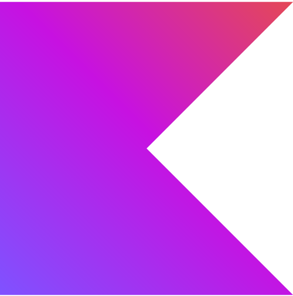
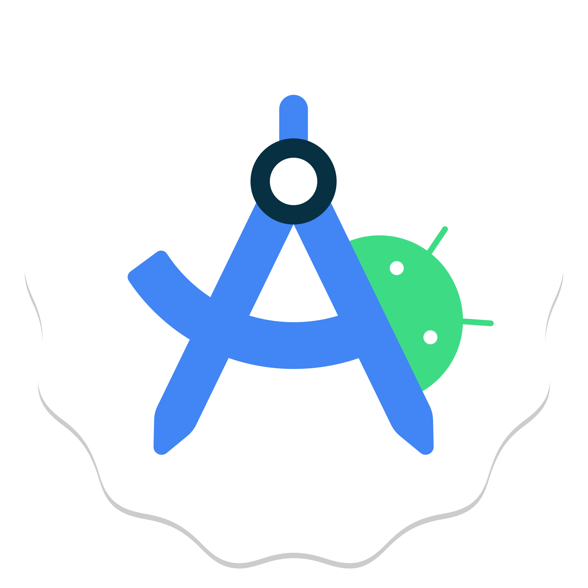
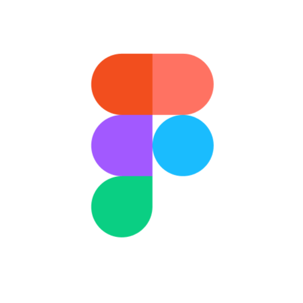
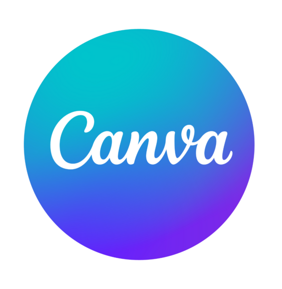
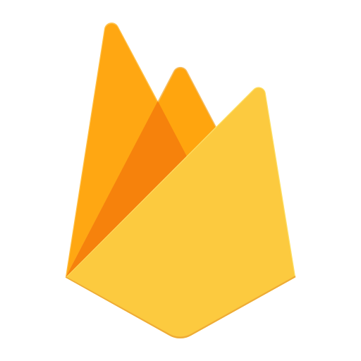

<h1 align="center">Hi there, I'm Asem </h1>
 
 

### About me:

- 👨🏻‍💻 I’m currently working as <b>`Android Developer`</b>
- 👨🏻‍🎓 I’m currently learning <b>`Jetpack Compose`</b>
- 💪🏻 Hard worker & self-motivating
- 🤝🏻 Connect with me on 
- ⬇ Get my apps on <a href="https://play.google.com/store/apps/dev?id=6617903911951431961">Play Store</a>
- 💼 <a href="https://asemlab.github.io">My portfolio</a>

 
 

### Languages and Tools:

 
 

### Github stats:

 

