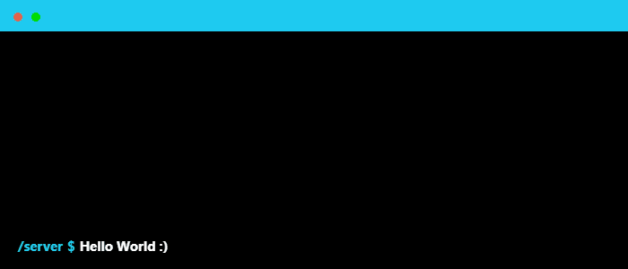
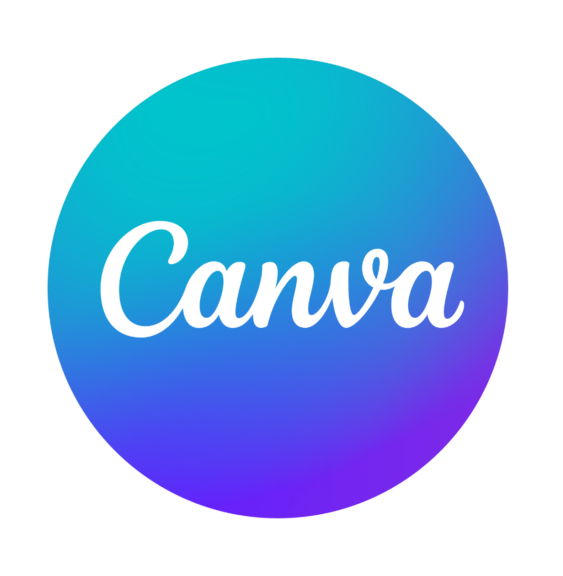

 
 

### Find me on 🕵🏻‍♂️
 

  

  

  

  
 

 
 

### Tech Stack 🛠
 

	<table>
		<tr>
			<td align="center" width="150" > Android</td>
			<td align="center" width="150"> Android Studio</td>
			<td align="center" width="150"> Koltin</td>
			<td align="center" width="150"> Intellij</td>
			<td align="center" width="150"> Java</td>
    </tr>
  	<tr>
			<td align="center"> Firebase</td>
			<td align="center"> Play Console</td>
			<td align="center"> Git</td>
			<td align="center"> Github</td>
			<td align="center"> Vysor</td>
    </tr>
    	<tr>
			<td align="center"> Postman</td>
			<td align="center"> Figma</td>
			<td align="center"> Canva</td>
			<td align="center"> Slack</td>
			<td align="center"> Clip</td>
    </tr>
	</table>

 
 

### Problem Solving 🤔
 

 
 

### Github stats 📊
 

	

 
 
